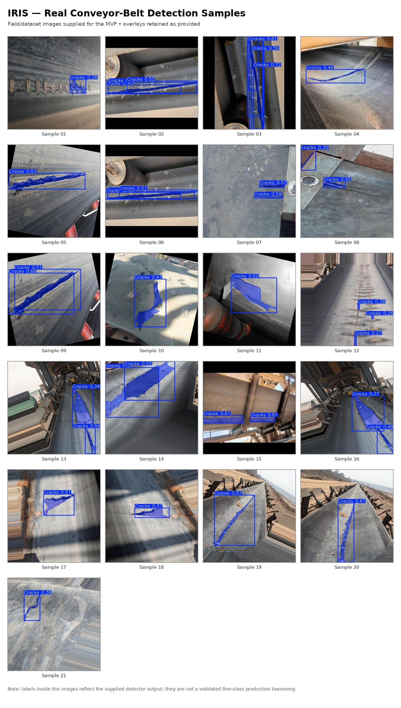
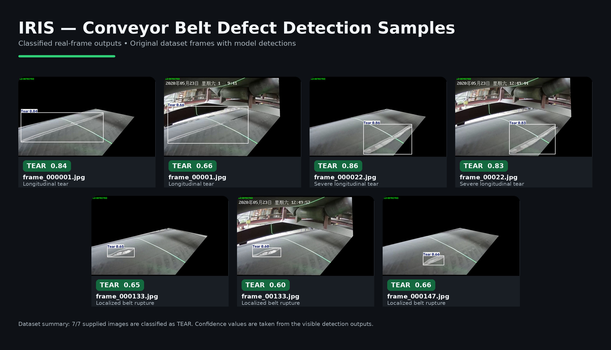
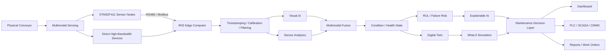
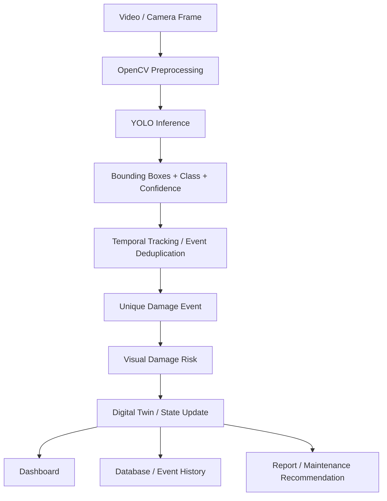
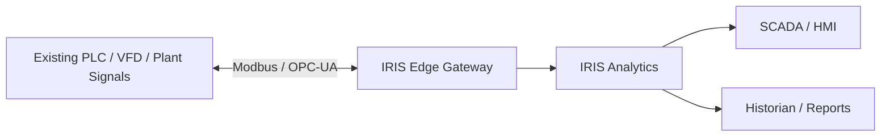
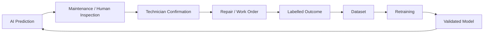

# IRIS — Intelligent Real-time Inspection System for Conveyor Belts

<p align="center">
  <strong>Edge-AI Conveyor Condition Monitoring, Digital Twin and Predictive-Maintenance MVP</strong>
</p>

<p align="center">
  <strong>Team:</strong> EcoNova &nbsp;|&nbsp;
  <strong>Competition:</strong> Smart India Hackathon 2026 &nbsp;|&nbsp;
  <strong>Problem Statement:</strong> SIH26008
</p>

---

## Abstract

**IRIS (Intelligent Real-time Inspection System for Conveyor Belts)** is an edge-first condition-monitoring and predictive-maintenance platform intended for conveyor systems used in mining, steel and bulk-material handling environments.

The SIH MVP focuses on demonstrating an end-to-end inspection workflow in which conveyor imagery is processed by a pretrained YOLO-compatible detector, repeated frame-level detections are converted into unique defect events, condition information is presented through an industrial dashboard, and the results are connected to the existing IRIS physics/Digital Twin software backbone for reporting and maintenance-oriented interpretation.

The broader IRIS architecture is multimodal. It is designed to combine **RGB vision, thermal sensing, vibration, acoustic sensing, tension/load, motor-current information, speed/position from an encoder, and 2D alignment/profile sensing**. Low-bandwidth sensing is distributed through STM32-based acquisition nodes, while computationally expensive analytics are centralized at an edge gateway.

IRIS is deliberately developed in stages. The **SIH MVP proves the inspection workflow**; **Industrial V1** adds rugged multimodal sensing, continuous edge inference and plant integration; the **Plant Pilot** provides the real degradation history required to validate Health Score, failure-risk and Remaining Useful Life (RUL) models.

> **Core design idea**  
> **SENSE → DETECT → MEASURE → FUSE → ASSESS → PREDICT → EXPLAIN → RECOMMEND → PREVENT**

---

## Table of Contents

- [1. Project Motivation](#1-project-motivation)
- [2. MVP Objective](#2-mvp-objective)
- [3. Current MVP vs Roadmap](#3-current-mvp-vs-roadmap)
- [4. Real Conveyor-Belt Detection, Defect Samples & System Video](#4-real-conveyor-belt-detection-defect-samples--system-video)
- [5. System Architecture](#5-system-architecture)
- [6. End-to-End MVP Data Flow](#6-end-to-end-mvp-data-flow)
- [7. Visual Detection Pipeline](#7-visual-detection-pipeline)
- [8. Temporal Tracking and Unique Defect Events](#8-temporal-tracking-and-unique-defect-events)
- [9. Visual Damage Risk](#9-visual-damage-risk)
- [10. Physics and Digital Twin Backbone](#10-physics-and-digital-twin-backbone)
- [11. Multimodal Sensor Architecture](#11-multimodal-sensor-architecture)
- [12. Health, Anomaly and RUL Roadmap](#12-health-anomaly-and-rul-roadmap)
- [13. Dashboard and Operator Experience](#13-dashboard-and-operator-experience)
- [14. API Interface](#14-api-interface)
- [15. Repository Structure](#15-repository-structure)
- [16. Requirements](#16-requirements)
- [17. Installation — Windows 11](#17-installation--windows-11)
- [18. Configure the YOLO Model](#18-configure-the-yolo-model)
- [19. Run the IRIS MVP](#19-run-the-iris-mvp)
- [20. Using Video Analysis](#20-using-video-analysis)
- [21. Using Live Detection](#21-using-live-detection)
- [22. Simulation / No-Model Mode](#22-simulation--no-model-mode)
- [23. Expected Outputs](#23-expected-outputs)
- [24. Performance Targets](#24-performance-targets)
- [25. Scientific and Engineering Claim Boundaries](#25-scientific-and-engineering-claim-boundaries)
- [26. Industrial PLC/SCADA Integration](#26-industrial-plcscada-integration)
- [27. Safety Architecture](#27-safety-architecture)
- [28. Harsh-Environment Design](#28-harsh-environment-design)
- [29. Deployment Roadmap](#29-deployment-roadmap)
- [30. Troubleshooting](#30-troubleshooting)
- [31. Reproducibility and Model Metadata](#31-reproducibility-and-model-metadata)
- [32. Project Status](#32-project-status)
- [33. Academic / Engineering Notes](#33-academic--engineering-notes)

---

# 1. Project Motivation

Industrial conveyor belts operate under continuous loading, impact, vibration, dust, heat, moisture, misalignment, repeated start-stop cycles and splice/joint stress. Degradation may appear as:

- cracks,
- tears,
- splice or joint opening,
- edge damage,
- surface abrasion,
- overheating,
- abnormal vibration,
- abnormal acoustic behaviour,
- tension imbalance,
- poor belt tracking,
- excessive motor load,
- foreign or tramp material.

Traditional inspection is often periodic and reactive. A visible defect may already have propagated before it is reported, and information from cameras, vibration sensing, temperature, load, alignment and plant controls is normally fragmented across separate systems.

IRIS addresses this as a **condition-intelligence problem**, not only as an object-detection problem. Its long-term goal is to create one understandable conveyor condition state from multiple sources and convert that state into maintenance-oriented information.

IRIS is designed to answer five operator questions:

1. **Is the conveyor healthy?**
2. **What is wrong?**
3. **How serious is it?**
4. **How is the condition changing?**
5. **What maintenance action should be considered?**

---

# 2. MVP Objective

The SIH MVP is intentionally smaller than the final industrial architecture. Its purpose is to prove a credible end-to-end workflow using available hardware and a pretrained detector.

### MVP proof points

- accept real conveyor video / image input,
- run a pretrained YOLO-compatible detector,
- draw detection bounding boxes and confidence values,
- track a physical defect across frames,
- avoid counting the same defect once per frame,
- generate unique defect events,
- calculate a **Visual Damage Risk** representation,
- demonstrate selected sensor / physics inputs,
- display results in an industrial dashboard,
- maintain event and state history,
- generate reports and maintenance-oriented outputs,
- demonstrate integration with the Digital Twin software backbone.

### MVP compute platform

The MVP is designed to run on the existing development laptop/GPU rather than requiring industrial embedded hardware during the hackathon stage.

Typical MVP environment:

- Windows 11,
- Python 3.11+,
- NVIDIA GPU where available,
- Ultralytics-compatible YOLO checkpoint,
- OpenCV,
- FastAPI + WebSocket backend,
- browser-based dashboard,
- SQLite persistence.

The laptop is a **development and demonstration platform**, not the final industrial enclosure.

---

# 3. Current MVP vs Roadmap

Clear separation between implemented/demo capability and future industrial validation is important for technical credibility.

| Capability | SIH MVP | Industrial V1 | Plant Pilot / Advanced |
|---|:---:|:---:|:---:|
| Pretrained YOLO visual detection | ✅ | ✅ | ✅ fine-tuned |
| Uploaded-video analysis | ✅ | ✅ | ✅ |
| Annotated output video | ✅ / MVP target | ✅ | ✅ |
| Temporal defect tracking | ✅ baseline | ✅ | ✅ |
| Unique defect-event generation | ✅ | ✅ | ✅ |
| Visual Damage Risk | ✅ | ✅ | ✅ |
| Selected sensor demonstration | ✅ | ✅ | ✅ |
| Physics / Digital Twin software backbone | ✅ | ✅ | ✅ expanded |
| Dashboard and reports | ✅ | ✅ | ✅ |
| Continuous industrial RGB inference | Demo / limited | ✅ | ✅ |
| STM32F411 distributed sensor nodes | Prototype / architecture | ✅ | ✅ |
| Jetson Orin Nano edge gateway | Not required | ✅ | ✅ |
| YOLO26n production detector family | Planned | ✅ | field fine-tuned |
| YOLO26-Seg + SAM 2 segmentation | Planned | ✅ | validated |
| EfficientNet severity classifier | Planned | ✅ | validated |
| Multimodal Health Score | Demo logic only / not field validated | ✅ initial | ✅ calibrated |
| LSTM Autoencoder + Isolation Forest | Planned | ✅ | validated |
| XGBoost multimodal fusion | Planned | ✅ | calibrated |
| PLC/SCADA via Modbus / OPC-UA | Architecture/demo | ✅ | plant validated |
| Production RUL / failure-risk model | Not claimed from video alone | initial | ✅ field validated |
| Gaussian Splatting / high-detail 3D reconstruction | Out of scope | Optional | Advanced |
| RL maintenance optimization | Out of scope | Out of scope | Advanced |

> **Important:** a working prototype output and a field-validated industrial metric are not the same thing. The project intentionally uses stage-gated AI so that advanced predictions are enabled only when sufficient validated data exists.

---

# 4. Real Conveyor-Belt Detection, Defect Samples & System Video

### 4.1 Real Detection Samples (MVP Evaluation Set)

The following collage contains the **21 real conveyor-belt images supplied for the MVP evaluation/demo set**. The detector overlays are retained from the supplied images:

<p align="center">
  
</p>

### 4.2 Industrial Conveyor Belt Defect Inspection Collage

The following inspection collage illustrates industrial conveyor belt defect patterns, surface abrasions, longitudinal tears, splice anomalies, and structural damage analyzed under the IRIS condition-monitoring framework:

<p align="center">
  
</p>

### 4.3 End-to-End System Video Demonstration

Watch the complete IRIS inspection workflow in action — demonstrating real-time conveyor vision inference, bounding-box defect localization, temporal defect tracking, Digital Twin state telemetry, and maintenance risk estimation:

<p align="center">
  <video src="assets/IRIS_system_demo.mp4" controls="controls" width="100%" style="max-width: 900px; border-radius: 8px;">
    Your browser does not support the video tag.
  </video>
</p>

> 📹 **Video Stream / Direct Link**: [`assets/IRIS_system_demo.mp4`](assets/IRIS_system_demo.mp4)

### Important interpretation note

The example images currently display the detector label **`Cracks`** with model-confidence values. These labels represent the output of the supplied checkpoint and should **not** be presented as proof that the current MVP checkpoint already performs the complete five-class production taxonomy.

The intended production taxonomy is:

1. Crack
2. Tear
3. Splice Gap
4. Edge Damage
5. Surface Damage

The final production model must be trained/fine-tuned and validated on site-specific belt material, camera angle, illumination, dust conditions, speed and target defect classes.

The individual source images are retained under:

```text
assets/real_samples/
```

---

# 5. System Architecture

IRIS follows a **distributed-sensing + centralized-edge-intelligence** architecture.

## 5.1 High-level architecture



## 5.2 Architecture philosophy

```text
Distributed sensing
        ↓
Centralized Edge AI
        ↓
Multimodal fusion
        ↓
Condition intelligence
        ↓
Maintenance decision support
        ↓
Industrial integration
```

Instead of placing a high-cost GPU computer at every sensing location, IRIS distributes low-cost sensor nodes along the conveyor and sends processed measurements/features to one central edge computer for each conveyor or monitored zone.

### Why this architecture?

- lower hardware cost per sensing location,
- deterministic sensor acquisition,
- reduced raw network traffic,
- easier scaling over long conveyors,
- centralized GPU inference,
- simplified model maintenance,
- easier PLC/SCADA integration,
- lower dependence on cloud connectivity.

---

# 6. End-to-End MVP Data Flow

For the SIH MVP, the visual workflow is the most important proof path.



The broader target data flow is:

```text
PHYSICAL CONVEYOR
        ↓
MULTIMODAL SENSORS
        ↓
STM32 SENSOR NODES + DIRECT HIGH-BANDWIDTH DEVICES
        ↓
FILTERING / FEATURE EXTRACTION / SYNCHRONIZATION
        ↓
CENTRAL EDGE GATEWAY
        ↓
VISION DETECTION + SENSOR ANALYTICS
        ↓
MULTIMODAL FUSION
        ↓
CONDITION / HEALTH STATE
        ↓
DEGRADATION ANALYSIS
        ↓
RUL / FAILURE-RISK MODEL
        ↓
EXPLAINABLE DECISION
        ↓
DIGITAL TWIN
        ↓
DASHBOARD / PLC / SCADA / REPORTS
        ↓
MAINTENANCE ACTION
```

---

# 7. Visual Detection Pipeline

## 7.1 MVP detector

The MVP uses a **pretrained Ultralytics-compatible YOLO model** supplied as a `.pt` checkpoint.

Typical path:

```text
models/best.pt
```

The objective is to prove the complete inspection pipeline without requiring a full production-scale labelled dataset during the hackathon stage.

### Input

- image frame,
- webcam / IP-camera frame,
- uploaded video frame.

### Detector output

For each detected object/defect:

```text
class_id
class_name
confidence
bounding_box [x1, y1, x2, y2]
timestamp
track_id / event_id
```

### Example inference pattern

```python
from ultralytics import YOLO

model = YOLO("models/best.pt")
results = model.predict(frame, conf=0.40, imgsz=640)
```

The actual repository implementation should remain the source of truth for exact parameters and function names.

## 7.2 Production detector roadmap

The selected production detector family is **YOLO26n**, chosen as an edge-oriented baseline for continuous inspection.

Planned visual stack:

```text
RGB Camera
    ↓
YOLO26n Detection
    ↓
Temporal Tracking
    ↓
YOLO26-Seg / SAM 2
    ↓
Defect Mask
    ↓
OpenCV Measurement
    ↓
EfficientNet Severity Classification
```

### Why not start with a heavier detector?

The intended product prioritizes low-latency edge inference. A larger model should only replace the lightweight baseline if measured accuracy gains justify the added compute, power and deployment cost.

---

# 8. Temporal Tracking and Unique Defect Events

A physical defect remains visible across multiple consecutive video frames. Counting every frame-level bounding box as a new fault would produce a misleading event count.

Without temporal tracking:

```text
1 physical tear × 50 video frames = 50 detections
```

With temporal tracking:

```text
1 physical tear across 50 frames = 1 unique defect event
```

IRIS therefore associates detections across time.

The engineering baseline is **ByteTrack** for temporal tracking. A simpler IoU-based association can also be used as a lightweight batch-processing fallback.

Typical association logic:

```text
YOLO detections
      ↓
compare with active tracks
      ↓
match by tracker / spatial overlap
      ↓
existing track ?
   ├── yes → update track
   └── no  → create new DamageEvent
```

Benefits:

- prevents double counting,
- gives stable event IDs,
- improves report quality,
- enables defect persistence measurement,
- provides meaningful timestamps,
- supports future defect-growth analysis.

---

# 9. Visual Damage Risk

For the SIH MVP, **video-only detection output is described as `Visual Damage Risk`** rather than a full conveyor Health Score or field-validated RUL prediction.

This distinction is important:

```text
YOLO confidence ≠ physical severity
```

and

```text
Visual evidence alone ≠ complete multimodal conveyor condition
```

A detector confidence value indicates the model's certainty about a detection. It does not independently measure how serious that damage is to the mechanical system.

The MVP can therefore use inputs such as:

- detected class,
- confidence,
- persistence across frames,
- relative bounding-box/mask size,
- number of unique events,
- repeated observations,
- qualitative severity logic.

A **full Health Score** belongs to the multimodal stage in which visual information is corroborated by physical sensor information.

---

# 10. Physics and Digital Twin Backbone

The IRIS software architecture includes a physics-informed Digital Twin backbone so that AI detections can eventually be interpreted against the operating state of the conveyor.

Existing / designed physics modules include:

- belt kinematics,
- encoder-based speed and position,
- belt tension,
- belt sag,
- vibration response,
- thermal behaviour,
- roller/bearing-related dynamics,
- IS 11592-related calculations/compliance logic,
- scenario / what-if analysis.

## 10.1 Encoder speed relation

For pulley circumference `C`, encoder pulses `Δp`, encoder resolution `PPR` and time interval `Δt`:

```text
v = (Δp / PPR) × C / Δt
```

The encoder can provide both:

- belt speed,
- position / chainage-like reference for a detected event.

## 10.2 Belt sag model

A parabolic sag approximation used in the physics layer is:

```text
y = wL² / (8T)
```

where:

- `w` = distributed belt/load weight,
- `L` = idler/span distance,
- `T` = relevant belt tension,
- `y` = estimated sag.

## 10.3 Digital Twin role

The Digital Twin is intended to represent:

- live conveyor operating state,
- defect position,
- sensor state,
- thermal condition,
- health/condition state,
- degradation trend,
- predicted risk,
- what-if scenarios.

Example future questions:

- What happens if conveyor load increases by 20%?
- What happens if belt speed increases?
- What happens if tension becomes abnormal?
- What happens if alignment error increases?

---

# 11. Multimodal Sensor Architecture

The target IRIS architecture uses multiple sensing modalities because no single sensor can observe every failure mechanism.

| Sensor / Source | Intended role | Connection strategy | Stage |
|---|---|---|---|
| RGB Camera | Visible crack/tear/splice/edge/surface anomalies | Direct to edge computer | MVP / V1 |
| MLX90640 thermal array | Hotspots / thermal trend | MCU → edge | MVP / V1 |
| Vibration sensor | Mechanical degradation / roller/bearing behaviour | MCU / industrial I/O → edge | V1 |
| INMP441 acoustic sensor | Acoustic transients / unusual sound energy | MCU → edge | MVP / V1 |
| Load cell + HX711 | Load / tension proxy | MCU → edge | MVP |
| Current transducer | Motor/load condition | MCU → edge | MVP / V1 |
| 600-PPR encoder | Belt speed / position | MCU timer/counter → edge | MVP |
| YDLIDAR X4 Pro | 2D alignment / lateral offset / belt edge profile | Direct to edge | V1 |
| PLC operational tags | Machine mode / speed / current / VFD state | Modbus / OPC-UA | V1 |

### High-bandwidth devices

Connect directly to the laptop/Jetson where possible:

- RGB camera,
- 2D LiDAR,
- future high-resolution thermal cameras.

### Deterministic lower-bandwidth devices

Acquire through the STM32F411:

- encoder,
- load/tension,
- current,
- DS18B20,
- MLX90640,
- INMP441,
- vibration channels,
- isolated status inputs.

---

# 12. Health, Anomaly and RUL Roadmap

These modules form the industrial analytics roadmap. They should not be confused with the minimum visual MVP.

## 12.1 Sensor anomaly detection

Planned baseline:

- engineered features,
- FFT / spectral features,
- statistical thresholds,
- Isolation Forest,
- LSTM Autoencoder.

Example normalized anomaly features:

```text
vibration_anomaly
thermal_anomaly
tension_anomaly
acoustic_anomaly
current_anomaly
alignment_anomaly
```

## 12.2 State estimation

Kalman filtering is used for:

- smoothing noisy measurements,
- estimating continuous state,
- combining measurements with expected physics behaviour.

Kalman filtering is **not** treated as a complete replacement for multimodal condition fusion.

## 12.3 Health Score

The planned Health Score is a **0–100 operator-facing condition indicator**.

Initial deployment philosophy:

```text
transparent weighted/rule-based score
             ↓
collect field labels and maintenance outcomes
             ↓
XGBoost / learned multimodal fusion
```

This keeps the early system auditable while the field dataset is still small.

## 12.4 Multimodal fusion

Planned primary model:

- XGBoost

Benchmark / alternatives:

- LightGBM,
- weighted decision fusion,
- confidence thresholds,
- temporal validation.

The purpose is to combine engineered features from vision and sensor channels into one interpretable condition estimate.

## 12.5 RUL and failure risk

Production RUL requires degradation history and censored maintenance/failure records. Candidate models include:

- Cox baseline,
- Random Survival Forest,
- XGBoost-AFT,
- LSTM,
- GRU,
- TCN,
- Transformer / TFT.

No single temporal model should be declared the production winner until field data is available for comparison.

Where uncertainty is high, IRIS should prefer an interval such as:

```text
Estimated RUL: 18–26 operating days
Trend: increasing degradation
Recommended action: inspect during the next maintenance window
```

rather than presenting an unrealistically precise failure date.

---

# 13. Dashboard and Operator Experience

The UI is designed as an industrial monitoring console rather than a model-debugging interface.

### Design principles

- dark industrial theme,
- data-dense but uncluttered,
- progressive disclosure,
- live status indicators,
- physics / sensor cross-checks,
- role-oriented information,
- condition → reason → risk → action.

### Main dashboard areas

| Tab | Purpose |
|---|---|
| **Live Detection** | Camera feed + YOLO overlays + event stream |
| **Video Analysis** | Upload prerecorded video and review annotated output |
| **Live Monitor** | KPIs, conveyor state, telemetry and fault demonstration |
| **Belt Health** | Condition/advisory information and standards-oriented calculations |
| **Sensor Lifetime** | Rated vs elapsed sensor-life monitoring |
| **AI Explainability** | Feature contributions / damage-event reasoning |
| **Physics Engine** | Kalman state, kinematics, vibration and thermal information |
| **Reports** | Export / historical information |
| **Maintenance** | Maintenance recommendations and event logging |

### Operator-facing philosophy

IRIS should show:

```text
CONDITION
REASON
RISK
ACTION
```

and hide low-level internals unless requested:

- raw tensors,
- packet dumps,
- raw SHAP arrays,
- SQL details,
- internal debug logs.

---

# 14. API Interface

Documented MVP endpoints include:

| Method | Path | Purpose |
|---|---|---|
| `GET` | `/api/health` | Backend health check |
| `GET` | `/api/state` | Current Digital Twin state |
| `POST` | `/api/detect/frame` | Run detection on a single frame |
| `POST` | `/api/detect/video` | Upload video for batch analysis |
| `POST` | `/api/faults/{type}` | Inject/reset supported demo faults |
| `WS` | `/ws/live` | Stream live Digital Twin state |

The feature architecture also defines a dedicated live detector WebSocket path such as:

```text
/ws/detect/live
```

when the live-camera streaming module is enabled in the active implementation.

---

# 15. Repository Structure

```text
IRIS/
│
├── app.py                      # Main application entry point
│
├── ai/                         # AI / ML modules
│   ├── damage_detection.py     # YOLO model loading + inference
│   ├── severity.py             # Severity / risk logic
│   ├── fusion.py               # Condition / fusion logic
│   ├── rul.py                  # RUL / degradation logic
│   ├── explainability.py       # Explainability helpers
│   └── sensor_health.py        # Sensor / belt advisory logic
│
├── physics/                    # Physics models
│   ├── kinematics.py
│   ├── belt_tension.py
│   ├── belt_sag.py
│   ├── vibration.py
│   └── thermal.py
│
├── estimation/                 # Kalman / state estimation
│
├── twin/                       # Digital Twin state and scenario engine
│   ├── engine.py
│   └── state.py
│
├── backend/                    # FastAPI routes and WebSocket handlers
│
├── database/                   # SQLAlchemy models / repositories
│
├── webar/                      # HTML / CSS / JavaScript dashboard
│
├── config/                     # YAML / runtime configuration
│   └── yolo.yaml               # YOLO path, thresholds, class mapping
│
├── models/                     # Model weights
│   └── best.pt                 # User-supplied pretrained checkpoint
│
├── assets/
│   ├── real_detection_collage.jpg
│   └── real_samples/           # 21 supplied conveyor images
│
├── requirements.txt
└── README.md
```

Some repositories may contain additional modules; the checked-in code should remain the final authority for exact filenames.

---

# 16. Requirements

## 16.1 Recommended MVP machine

- Windows 11 or Linux,
- Python 3.11+,
- 8 GB+ system RAM recommended,
- NVIDIA GPU recommended for faster inference,
- CPU fallback supported by the design,
- modern browser for the dashboard.

The development MVP was designed around an RTX-class laptop GPU. Industrial deployment is planned around an embedded edge computer such as the **NVIDIA Jetson Orin Nano**.

## 16.2 Main software stack

- Python
- Ultralytics-compatible YOLO runtime
- PyTorch
- OpenCV
- NumPy
- SciPy
- Pandas
- scikit-learn
- FastAPI
- Uvicorn
- WebSocket
- SQLAlchemy
- SQLite
- Matplotlib / reporting utilities

Additional V1/pilot dependencies may include:

- XGBoost,
- LightGBM,
- SHAP,
- survival-analysis packages,
- Open3D / 3D libraries.

Install the exact versions declared in the repository's `requirements.txt`.

---

# 17. Installation — Windows 11

The following is the recommended clean setup for the SIH MVP.

## Step 1 — Clone or extract the repository

```powershell
git clone <YOUR_REPOSITORY_URL>
cd IRIS
```

If the repository was downloaded as a ZIP, extract it and open PowerShell inside the project directory.

## Step 2 — Verify Python

```powershell
py -3.11 --version
```

Expected:

```text
Python 3.11.x
```

If `py -3.11` is unavailable but `python` points to Python 3.11+, use `python` in the commands below.

## Step 3 — Create a virtual environment

```powershell
py -3.11 -m venv .venv
```

## Step 4 — Activate the environment

```powershell
.\.venv\Scripts\Activate.ps1
```

If PowerShell blocks local activation scripts, either use Command Prompt:

```cmd
.venv\Scripts\activate.bat
```

or adjust the PowerShell execution policy according to your organization's security policy.

## Step 5 — Upgrade pip

```powershell
python -m pip install --upgrade pip
```

## Step 6 — Install project dependencies

```powershell
pip install -r requirements.txt
```

## Step 7 — Add the YOLO checkpoint

Place the pretrained model at:

```text
models/best.pt
```

If the repository supports simulation fallback, IRIS can still start without this file, but real conveyor detection will not be produced by YOLO until a valid checkpoint is present.

---

# 18. Configure the YOLO Model

The model configuration is expected under a file such as:

```text
config/yolo.yaml
```

A typical configuration structure is:

```yaml
yolo:
  model_path: "models/best.pt"
  confidence_threshold: 0.40
  iou_threshold: 0.50
  image_size: 640
  device: "auto"
```

## 18.1 Class mapping rule

**The class map must exactly match the classes stored in the model checkpoint.**

Do not configure five production classes if the checkpoint was trained only for a generic `Cracks` or `Damage` class.

Example for a one-class checkpoint:

```yaml
class_mapping:
  0: "Cracks"
```

Example future five-class production mapping:

```yaml
class_mapping:
  0: "CRACK"
  1: "TEAR"
  2: "SPLICE_GAP"
  3: "EDGE_DAMAGE"
  4: "SURFACE_DAMAGE"
```

Use the second mapping **only after the trained model actually supports those classes**.

## 18.2 Device selection

Typical values:

```yaml
device: "auto"
```

or

```yaml
device: "cpu"
```

or, for a compatible NVIDIA/PyTorch installation:

```yaml
device: "cuda:0"
```

If CUDA is not available, use CPU mode rather than forcing `cuda:0`.

---

# 19. Run the IRIS MVP

With the virtual environment active:

```powershell
python app.py
```

The documented default dashboard address is:

```text
http://localhost:8000
```

Open it in a browser.

## 19.1 Verify backend health

From another PowerShell terminal:

```powershell
Invoke-RestMethod http://localhost:8000/api/health
```

or open:

```text
http://localhost:8000/api/health
```

in a browser.

## 19.2 Verify current state endpoint

```powershell
Invoke-RestMethod http://localhost:8000/api/state
```

If the server starts successfully but the dashboard is blank, first confirm that these API endpoints respond before debugging the frontend.

---

# 20. Using Video Analysis

The Video Analysis workflow is particularly suitable for the SIH MVP because it can demonstrate real inference reliably from prerecorded conveyor footage.

## Typical workflow

1. Start the IRIS server.
2. Open `http://localhost:8000`.
3. Open the **Video Analysis** tab.
4. Select or drag-and-drop a conveyor video.
5. Start analysis.
6. The backend extracts frames using OpenCV.
7. Selected frames are passed to the YOLO detector.
8. Detections are associated across frames.
9. Bounding boxes are rendered on the output video.
10. Unique events are added to the event log.
11. The dashboard displays the result summary.

Documented accepted formats include:

```text
.mp4
.avi
.mkv
.mov
```

The feature specification uses a configurable maximum file size and frame-sampling interval. A documented default is to process every `N`th frame rather than every original frame when faster batch analysis is required.

Expected batch outputs can include:

- annotated MP4,
- event list,
- timestamps,
- class names,
- confidence values,
- unique event count,
- worst visual-risk category,
- structured `detection_log.json` or equivalent repository output.

---

# 21. Using Live Detection

Where the live-camera module is enabled:

1. Open **Live Detection**.
2. Select the available webcam / configured camera source.
3. Click **Start Live Detection**.
4. Frames are sent to the backend.
5. YOLO inference runs on the frame stream.
6. Annotated frames and detection metadata are returned.
7. New unique events update the dashboard/state pipeline.

The intended live interface displays:

- camera image,
- bounding box,
- checkpoint class label,
- confidence,
- FPS,
- model name,
- inference latency,
- event feed.

### Browser camera access

If the browser asks for camera permission, allow access only for the intended local IRIS instance.

---

# 22. Simulation / No-Model Mode

The documented repository design allows the application to start without a YOLO checkpoint and fall back to simulation behaviour.

This is useful for testing:

- dashboard layout,
- Digital Twin state updates,
- API behaviour,
- report generation,
- physics modules,
- fault-injection demonstrations.

It is **not** equivalent to real visual detection.

For real inference, confirm that:

```text
models/best.pt
```

exists and loads successfully.

---

# 23. Expected Outputs

Depending on the active modules, IRIS can produce the following output layers.

## 23.1 Detection output

```text
Event ID
Timestamp
Class
Confidence
Bounding box
Track ID
Persistence / duration
```

## 23.2 MVP condition output

```text
Visual Damage Risk
Unique visual defect count
Worst detected visual condition
Trend / repeated observation
Recommended inspection priority
```

## 23.3 Digital Twin / physics output

```text
Belt speed
Estimated position
Tension/sag state
Vibration state
Thermal state
Scenario state
```

## 23.4 Future multimodal output

```text
Health Score
Failure Risk
Estimated RUL interval
Main risk contributors
Maintenance recommendation
```

---

# 24. Performance Targets

The following are **design targets / acceptance criteria**, not automatic claims of measured field performance.

| Metric | Target |
|---|---:|
| YOLO inference latency on GPU | `< 100 ms/frame` |
| YOLO inference latency on CPU | `< 500 ms/frame` |
| Live detection display | `≥ 10 FPS` target |
| Video analysis | Complete annotated output + event log |
| Detection-to-state update | Same processing cycle / tick |
| Dashboard first paint | `< 2 s` target |
| New detection-module test coverage | `≥ 90%` target |

Actual values depend on:

- GPU/CPU,
- model size,
- input resolution,
- video codec,
- frame-sampling interval,
- number of concurrent users,
- background workloads.

For an academic evaluation, report measured results from the actual test machine rather than presenting these targets as achieved results.

---

# 25. Scientific and Engineering Claim Boundaries

This section is intentionally explicit because IRIS is an engineering prototype and should be presented with technically defensible claims.

## 25.1 Detector classes

Only display classes that the loaded checkpoint actually supports.

Do **not** claim five-class production detection from a single-class checkpoint.

## 25.2 Confidence is not severity

```text
YOLO confidence = model certainty
Severity = physical seriousness of damage
```

These are different variables.

## 25.3 Physical dimensions require calibration

Do not report defect length in `mm` or `cm` from raw pixels unless the camera is calibrated.

Required for physical measurement:

- camera calibration,
- known scale/reference,
- perspective correction / homography,
- stable installation geometry.

Until calibration is available, use:

- pixel dimensions,
- relative area,
- mask area ratio,
- qualitative severity.

## 25.4 2D LiDAR is not a 3D scanner

The YDLIDAR X4 Pro is treated as a **2D LiDAR** for:

- alignment,
- lateral offset,
- edge/profile information.

It should not be described as directly producing a complete 3D conveyor reconstruction.

## 25.5 RUL requires degradation history

A reliable industrial RUL model needs longitudinal operating and maintenance data, including censored cases.

Video-only output should not be presented as validated RUL.

## 25.6 Digital Twin predictions require validation

Physics and what-if modules are useful for analysis and demonstration, but plant deployment requires parameter calibration and validation against physical measurements.

---

# 26. Industrial PLC/SCADA Integration

IRIS is designed as a **brownfield retrofit**. It does not require replacement of the plant PLC or SCADA system.



Planned communication options include:

- RS485,
- Modbus RTU,
- Modbus TCP,
- OPC-UA,
- Industrial Ethernet.

### Typical information from PLC to IRIS

```text
Motor status
VFD frequency
Motor current
Conveyor speed
Production mode
Load state
Operating state
```

### Typical information from IRIS to PLC/SCADA

```text
IRIS_HealthScore
IRIS_DefectCode
IRIS_Severity
IRIS_RUL
IRIS_FailureRisk
IRIS_Vibration
IRIS_Temperature
IRIS_Tension
IRIS_Alignment
IRIS_MaintenanceRequired
```

For the MVP, these are architecture/interface definitions. Full industrial tag mapping and plant commissioning belong to Industrial V1 / pilot validation.

---

# 27. Safety Architecture

IRIS is a **condition-monitoring and maintenance decision-support system**. Safety-critical shutdown logic must not depend solely on AI inference, a dashboard, a network connection or a general-purpose edge computer.

The broader IRIS architecture defines a separated hardware path such as:

```text
Tramp-Metal Detector
        ↓
Safety Relay
        ↓
VFD STO / Motor Interlock
        ↓
Conveyor Stop
```

The AI platform may monitor an isolated safety status for logging, but the critical trip path remains independent.

> **The SIH software MVP must not be interpreted as a safety-certified control system.**

---

# 28. Harsh-Environment Design

Industrial conveyor deployment must account for:

- dust,
- vibration,
- heat,
- moisture,
- material impact,
- optical contamination.

Industrial V1 therefore includes design provisions such as:

- IP65/IP67 sensor pods,
- protected optical windows,
- vibration-isolated camera mounts,
- controlled LED illumination,
- compressed-air purge / air knife,
- optional mechanical wiper,
- 24 V industrial power,
- cable glands,
- shielded communication wiring.

These are industrialization requirements rather than assumptions about the laptop-based MVP enclosure.

---

# 29. Deployment Roadmap

## Stage 1 — SIH MVP

Focus:

- scaled conveyor / demonstration setup,
- existing laptop/GPU,
- pretrained visual AI,
- temporal tracking,
- unique events,
- Visual Damage Risk,
- selected low-cost sensors,
- dashboard,
- reports,
- end-to-end workflow proof.

## Stage 2 — Industrial V1

Focus:

- Jetson-class edge gateway,
- STM32F411 distributed sensing,
- RGB + thermal + 2D LiDAR,
- rugged vibration/load sensing,
- encoder/current channels,
- synchronized acquisition,
- anomaly detection,
- initial Health Score,
- PLC/SCADA communication,
- local historian,
- industrial enclosure and wiring.

## Stage 3 — Plant Pilot

Focus:

- multiple monitored conveyor sections,
- field installation and commissioning,
- camera/sensor calibration,
- baseline data collection,
- site-specific model fine-tuning,
- false-alarm analysis,
- maintenance-history integration,
- Health Score calibration,
- RUL/failure-risk validation,
- environmental robustness testing.

## Stage 4 — Advanced / Scaled Deployment

Possible additions:

- high-detail 3D reconstruction,
- Gaussian Splatting,
- point-cloud analysis,
- physics-informed Digital Twin expansion,
- fleet analytics,
- maintenance-policy optimization,
- reinforcement-learning research after adequate validation infrastructure exists.

---

# 30. Troubleshooting

## 30.1 `models/best.pt` not found

Check:

```text
IRIS/
└── models/
    └── best.pt
```

Also verify `config/yolo.yaml` points to the same path.

If the application supports simulation fallback, the dashboard may start even though real detection is unavailable.

## 30.2 CUDA is unavailable

Test from Python:

```python
import torch
print(torch.cuda.is_available())
```

If it returns:

```text
False
```

run in CPU mode or install a PyTorch build compatible with the machine's NVIDIA environment.

Do not force `cuda:0` if CUDA is unavailable.

## 30.3 Inference is slow

Try:

- GPU instead of CPU,
- lower input resolution,
- smaller model,
- frame sampling for uploaded video,
- closing other GPU-heavy applications.

Do not reduce resolution so aggressively that important narrow belt defects become invisible.

## 30.4 Too many duplicate detections

Check:

- temporal tracker is enabled,
- IoU/association threshold,
- confidence threshold,
- track lifetime,
- camera motion,
- frame-sampling interval.

## 30.5 Model detects the wrong class names

The checkpoint class list and `class_mapping` do not match.

Inspect the model's stored class names and update configuration. Do not rename a generic detector output into unsupported production classes.

## 30.6 Dashboard opens but no state appears

Check:

```text
http://localhost:8000/api/health
http://localhost:8000/api/state
```

If the API works, inspect the browser console / WebSocket connection.

## 30.7 Webcam does not open

Check:

- browser camera permission,
- whether another program is using the camera,
- correct camera index / IP-camera URL,
- backend camera configuration.

## 30.8 Uploaded video cannot be processed

Check:

- extension is supported by OpenCV,
- file is not corrupted,
- file size is below configured limit,
- local codec support,
- output directory is writable.

---

# 31. Reproducibility and Model Metadata

For every model used in an academic demo or industrial pilot, record:

```text
model_name
model_version
dataset_version
class_map
training_date
validation_metrics
confidence_threshold
IoU_threshold
input_resolution
site_id / test_setup
deployment_date
software_commit
```

A recommended feedback loop is:



Useful labels include:

- true positive,
- false positive,
- false negative,
- severity correction,
- repair performed,
- component replaced,
- no fault found,
- actual failure.

This closes the gap between an AI demonstration and a maintainable industrial model lifecycle.

---

# 32. Project Status

### SIH MVP

The project is organized around proving a working end-to-end conveyor inspection and Digital Twin workflow using available compute and real visual samples.

### Industrialization status

The following require additional engineering and/or field validation before they should be described as production-ready:

- rugged sensor pods,
- long-term synchronized sensor deployment,
- final five-class defect model,
- calibrated physical damage measurement,
- multimodal Health Score,
- plant-specific PLC/SCADA tag integration,
- production failure-risk/RUL calibration,
- safety certification,
- harsh-environment reliability validation.

---

# 33. Academic / Engineering Notes

IRIS is intended to demonstrate a structured migration from a hackathon MVP to an industrial condition-monitoring platform.

The central engineering principle is not to maximize the number of AI models. The priority order is:

1. reliable input acquisition,
2. working visual detection,
3. temporal tracking,
4. unique event generation,
5. synchronized sensor information,
6. understandable dashboard output,
7. transparent condition logic,
8. field validation,
9. advanced RUL and failure-risk models,
10. high-detail Digital Twin / optimization research.

A smaller system that works end-to-end and clearly states its validation limits is more useful than a large architecture in which every model is presented as production-ready without field evidence.

---

## Quick Start Summary

```powershell
# Create environment
py -3.11 -m venv .venv
.\.venv\Scripts\Activate.ps1

# Install dependencies
python -m pip install --upgrade pip
pip install -r requirements.txt

# Put the pretrained model here:
# models/best.pt

# Run IRIS
python app.py

# Open:
# http://localhost:8000
```

---

<p align="center">
  <strong>IRIS — Detect degradation early, understand its progression, and convert machine data into actionable maintenance intelligence.</strong>
</p>
